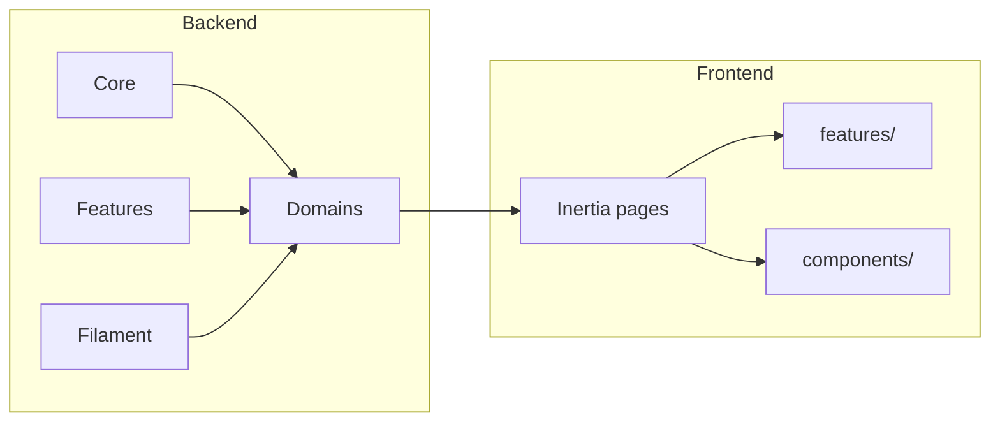

# Overview

Backend is organized around **Core** (cross-cutting) and **Domains** (vertical slices). Frontend is organized around **features** with Inertia pages and shared components.

## Directory structure

**Backend (`app/`)**

- `Core/` — Middleware, Models (Language, Setting, FeatureFlag), Observers, Policies, Providers, Services (PagePropsService), Contracts, Inertia (TestingViewFinder).
- `Domains/<Name>/` — Auth, Blog, Contact, Dashboard, Landing, Page, Profile, Search. Each may have Http/, Models/, Observers/, Policies/, Queries/, Services/, Actions/, Jobs/.
- `Features/` — Pennant feature-flag definitions only.
- `Filament/` — Admin UI; resources reference Core/Domain models.
- `Http/Controllers/Controller.php` — Base controller only.

**Frontend (`resources/js/`)**

- `features/<name>/pages/` — Inertia page components (e.g. `blog/Index` → `features/blog/pages/Index.tsx`).
- `components/ui/` — Shadcn primitives; `components/common/` — shared compositions.
- `layouts/`, `hooks/`, `store/`, `themes/`, `i18n/`, `lib/`, `services/`, `types/`.

See [Backend](backend.md) and [Frontend](frontend.md) for detail.
